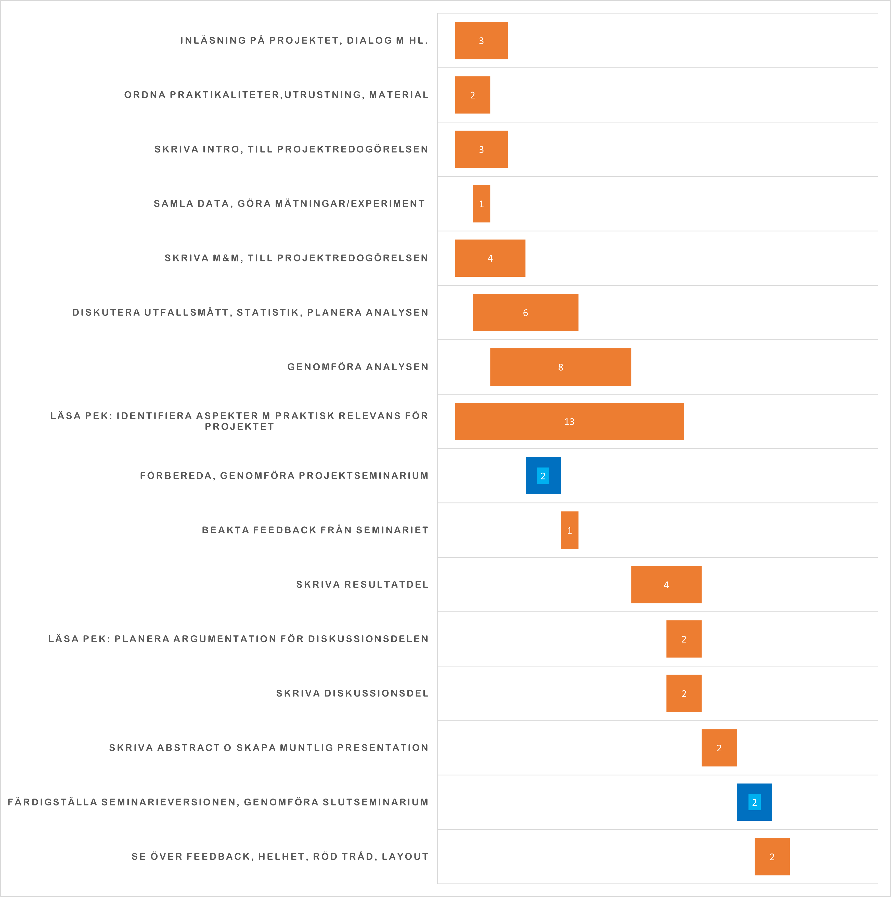

```{r setup, include=FALSE}
setwd("~victoriab/Trauma-resuscitation-procedures")

source("clean_all_predictors.R") ## This cleans the data from inaccurate values
source("clean_audit_filters.R") ## cleans the "VK" columns, aka our audit filters.
source("format_table1.R") ## change "labels" for columns -> better outputs in tables
source("create_flowchart.R") ## Function to create flowchart, check create_flowchart.R for details and customization.
source("main.R") ## This "imports" the main script file of your project and run any code in it

```

## List of Abbreviations 
<!-- bokstavsordning --->
* ISS - Injury Severity Score
* KUH - Karolinska University Hospital
* M&M - Morbidity and mortality
* OFI - Opportunities for improvement


# Introduction
## Background 
### Trauma and trauma care
Traumatic injuries (TI) are defined as physical injuries due to sudden severe events causing life-threatening conditions with serious morbidity and mortality. These injuries are common worldwide, particularly in young people [@Candef; @Evans]. In 2020, it was responsible for an estimated 4.4 million deaths, accounting for approximately 8% of all deaths globally [@who21].
Traumatic injuries can be complex and require multidisciplinary treatment and rehabilitation, resulting in a significant global public health care burden with high global personal and societal costs [@Evans]. For example, road traffic injuries estimated to cost $1.8 trillion per year [ @Chen2019]. 

The leading causes of traumatic injuries are motor vehicle accidents, falls, and penetrating trauma due to violence-related injuries. Moreover, the causes of traumatic injury can vary over time and might be influenced by various factors such as age, population behavior, and resources for trauma prevention and treatment [@who21; @who14].

Previous studies show that the quality of trauma care plays a significant role in patient outcomes. The higher quality of trauma care, the better results [@Demetriades2005; @Teixeira2007].Immediate trauma assessment requires a broad series of interventions depending on the type and severity of the trauma as well as the patient’s specific needs [@Martin2021]. Resuscitation procedures, such as airway management, damage control, and blood transfusion, are crucial in stabilizing the patient and preserving vital organ functions. Immediate, systematic, and effective implementation of these interventions will significantly improve the patient’s chances of survival and recovery [@Martin2021], emphasizing the importance of having a well-functioning trauma system [@Peitzman1999; @Cole2019; @Moran2018]. 

A trauma system consists of an organized and coordinated network of pre-hospital and in-hospital healthcare facilities and services integrated with the local public health organization and designated to provide immediate care to injured patients. 

Key elements of a trauma system include specialized trauma centers, prehospital care, and quality improvement programs to provide appropriate services across the continuum of whole trauma care [@Martin2021, @Moran2018]. Trauma centers are specialized units at hospitals that are equipped and staffed with experienced medical professionals to provide multidisciplinary advanced care [@Candef]. The level of care provided by a trauma center varies from the highest (level 1) to the lowest (Level IV) level of care. 

During the assessment of trauma patients, scoring systems, such as the Injury Severity Score (ISS), are used to evaluate the severity of the injuries and decide the appropriate level of trauma care based on the severity of their injuries [@ISS2022]. It is believed that such a systematic implementation of trauma-level systems might reduce the mortality and morbidity caused by trauma injuries [@Demetriades2005]. Moreover, it may result in a decrease in the costs associated with initial treatment and continued rehabilitation of trauma patients and hence reducing the healthcare burden

### Opportunities for improvement 

The quality improvement programs aim to ensure the delivery of safe and high-quality healthcare. One such program is the Morbidity and Mortality (M&M) conference, which focuses on patient care. The conference’s primary goal is to identify Opportunities for Improvement (OFI) and areas where care may be lacking. M&M conferences play a crucial role in improving healthcare quality by providing a platform for multidisciplinary teams to use a systematic approach to identify areas for improvement [@Blackmore2019]. In addition, data from the cases are collected and analyzed to identify recurring patterns of OFI, enabling the development of new guidelines to prevent similar outcomes from occurring in the future [@who09; @Blackmore2019].

One common area where OFIs are found is during the initial resuscitation, where immediate and appropriate intervention significantly impacts the patient’s outcomes. The primary care objective during this phase of trauma assessment is damage control as well as the immediate detection and treatment of life-threatening injuries. The OFIs related to resuscitation are often due to clinical judgment errors and involve airway management, fluid resuscitation, bleeding control, and chest injury management [@Sanddal2011; @Roy2017; @OReilly2013; @Ghorbani2018; @Vioque2014]. 

Factors contributing to OFIs are inadequate staffing levels, outdated equipment, and technology, or inadequate pre-hospital care [@Ghorbani2018]. 


### OFIs in resuscitation procedures
Historically, trauma care has received less attention and support internationally compared to other medical specialties [@Sakran2012]. Despite this, there is a lot of literature on quality improvement in trauma care. A study from 2014 found that the incidence of preventable trauma deaths varies widely with mortality rates of 2% to 29% depending on the definitions used [@Vioque2014]. In a recent study from Karolinska University Hospital, a Level 1 trauma center, the reported trauma mortality rate was 4% [@Spahn2019]. OFIs exist in even the most well-equipped and staffed trauma centers [@Teixeira2007]. 

Despite some progress in this field [@Ghorbani2018; @Berbiglia2013; @Teixeira2007; @Cole2019; @Spahn2019; @Delay], limited research exists on the correlation between resuscitation procedures and mortality, and the inclusion of morbidity data is scarce.

# Aim
We hypothesize that the resuscitation procedures done in the emergency department, are associated with OFI. 
This study explores the relationship between resuscitation procedures and possible improvement in outcomes for adult patients with severe trauma.<!-- (Where do I define severe trauma, and how?) -->

The findings in this study are expected to provide new insights into trauma care and contribute to the improvement of trauma care guidelines and consequently might decrease the healthcare burden caused by trauma injuries.

<!-- There are a large number of heterogeneous indicators that are diffusely and non-homogeneously utilized, and there is a wide range of vision and perception of TQIs across the world, reflecting different cultural and organizational models. There is a need of a common set of evidence-based and broadly accepted trauma quality indicators (TQIs) 10.1186/s13017-021-00350-7 -->

# Methods
### Study design

We conducted a registry-based study using data on trauma patients in two registries at Karolinska University Hospital (KUH): the trauma registry and the trauma care quality database. The trauma registry reports to the Swedish Trauma Registry and includes pre-hospital, hospital, and post-hospital care information following the Utstein template [@Dick1999]. 
The trauma care quality database consists of cases selected for the M&M conference with information on OFI.

The two databases were linked and analyzed to estimate the association between the resuscitation procedures <!-- Do I need to defien this here? --> and opportunities for improvement using multivariable logistic regression.

### Setting

The Karolinska University Hospital is situated in Solna, Sweden, and is the primary trauma center for the Stockholm region and several other regions. This means that KUH is the main center for treating traumatic injuries for approximately 3 million people. The trauma center at KUH meets the standards of a level 1 trauma center defined by the American College of Surgeons [@NKSlev1]. All high-priority patients in Stockholm are transported to KUH for treatment by a trauma team. Cases suspected of OFI are included in the M&M conference and reviewed by a multidisciplinary team, which assigns an OFI if appropriate. Regardless of whether an OFI is given, all cases are recorded in a database.

### Participants

Patients had to be at least 15 years old and be included in the trauma registry and the trauma care quality database.

The trauma registry includes patients who met the criteria for a trauma alert at the hospital, those admitted with a NISS score greater than 15, and transferred patients within 7 days of the event with NISS greater than 15. Chronic subdural hematoma injuries and false trauma alerts were excluded.

The trauma care quality database includes all patients reviewed by the Morbidity and Mortality board, who were carefully selected by two specialized nurses.

We performed a complete case analysis, meaning patients with incomplete data were excluded from the study. We collected data from patients registered between 2017 and 2021.


### Variables

***Study outcome***

The study’s primary endpoint will be the binary variable “opportunities for improvement.” The outcome will be assigned either as “Yes” if at least one OFI is identified or “No” if no OFIs are identified. The data for this outcome will be obtained from the trauma care quality database.

***Exposures***

These variables include thoracotomy, laparotomy, pelvic packing, revascularization, radiological intervention, craniotomy, intracranial pressure measurement, thoracic drain, external fracture fixation, major fracture surgery and operating room wound revision.

***Potential confounders***

Gender, age, blood pressure, respiratory rate, Glasgow Coma Scale (GCS) and Injury Severity Score (ISS)  

### Bias

Bias is avoided by using synthetic data during the development of the analysis model, which is later implemented on patient data. <!-- Did I understand this right -->


### Study size

We will include all patients in both the KUH trauma care quality registry and the corresponding information from the KUH trauma registry. Registration took place between 2017 and 2021, with a total of approximately <!---->patients.


### Statistical methods

The data was compiled and analyzed using R, a statistical computing language. The conversion and handling of variables were done according to the SweTrau manual [@Manual2021]. A multivariable logistic regression was conducted to find the significant association between resuscitation procedures and opportunities for improvement. The results were presented with a 95% confidence level and a p-value less than 0.05 was considered significant.

### Ethical considerations
***Respect for autonomy***

No consent has been given and we are aware of the risk of data breach. We this in mind we protect the patient information in a secure database and fully anonymize patient names and ID numbers. 
<!-- Patient deceased? Impossible to obtain consent from all patients retrospectively? Registry-based study approved by the Ethical Review Board does not need to include patient consent? -->

***The Principle of Justice***

All patients who meet the inclusion criteria are included, regardless of their background or demographic. 
***The Principle of Beneficence***

By identifying areas for improvement in resuscitation procedures, we can implement changes that will ultimately lead to reduced mortality and morbidity among future trauma patients. Also, this has the potential to alleviate the burden that trauma injuries place on public health systems.

***The Principle of Non-malefience***

With authorized personnel being the only ones with access to the database and the data being anonymized and securely stored, the risk of data misuse and leakage is kept to a minimum. 

***Ethical permit***

Stockholm Research Ethics Review Board approval number 2021-02541 and 2021-03531.


# Results
<!--I just wanted to show how to get the flowchart, see the create_flowchart.R file for details and if you might want to change anything. Note that the numbers are off because of scrambled data -->

```{r ofi-flowchart, out.width="100%",fig.cap=" Flowchart describing the exclusions made and the process of trauma cases from arrival until OFI decision.", echo=FALSE, fig.align='center'}
# Flowchart figure
knitr::include_graphics("ofi-flowchart.pdf") 
```


<!--
```{r, echo=FALSE, out.width = "400px"}

```
-->

# References
